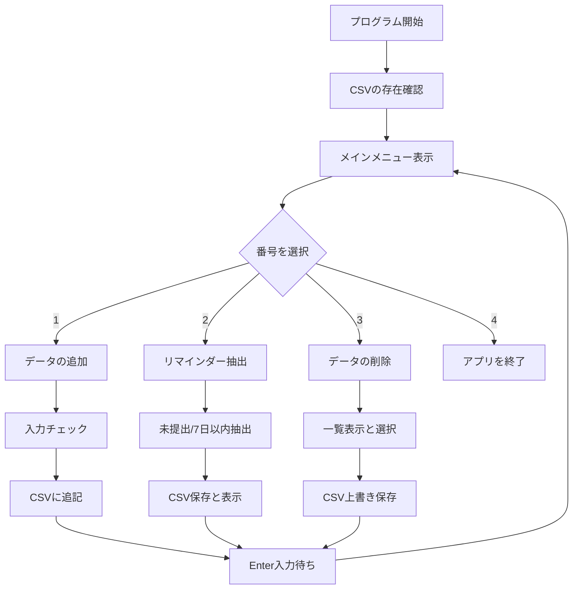

```mermaid
graph TD
    Start[プログラム開始] --> Init[CSVの存在確認]
    Init --> Menu[メインメニュー表示]
    Menu --> Branch{番号を選択}

    Branch -- 1 --> Add[データの追加]
    Add --> Check[入力チェック]
    Check --> Save1[CSVに追記]
    Save1 --> Wait[Enter入力待ち]

    Branch -- 2 --> Ext[リマインダー抽出]
    Ext --> Filter[未提出/7日以内抽出]
    Filter --> Save2[CSV保存と表示]
    Save2 --> Wait

    Branch -- 3 --> Del[データの削除]
    Del --> List[一覧表示と選択]
    List --> Save3[CSV上書き保存]
    Save3 --> Wait

    Branch -- 4 --> End[アプリを終了]

    Wait --> Menu
```
