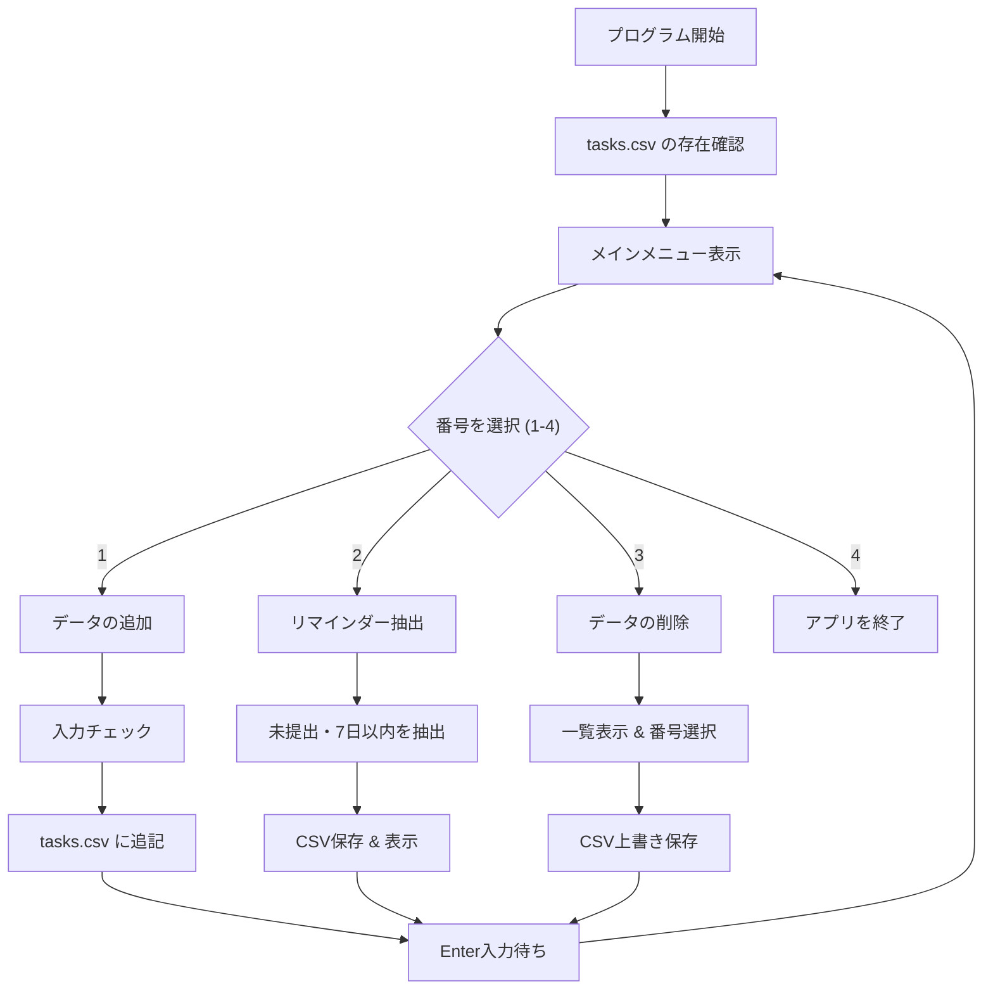

```mermaid
flowchart TD
    A["プログラム開始"] --> B["tasks.csv の存在確認"]
    B --> C["メインメニュー表示"]
    C --> D{"番号を選択 (1-4)"}

    D -- "1" --> E["データの追加"]
    E --> F["入力チェック"]
    F --> G["tasks.csv に追記"]
    G --> Z["Enter入力待ち"]

    D -- "2" --> H["リマインダー抽出"]
    H --> I["未提出・7日以内を抽出"]
    I --> J["CSV保存 & 表示"]
    J --> Z

    D -- "3" --> K["データの削除"]
    K --> L["一覧表示 & 番号選択"]
    L --> M["CSV上書き保存"]
    M --> Z

    D -- "4" --> N["アプリを終了"]

    Z --> C
```
